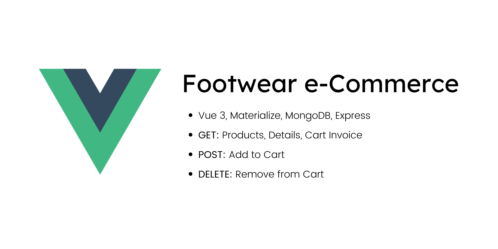
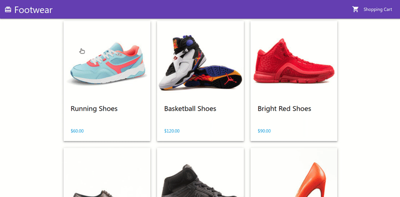
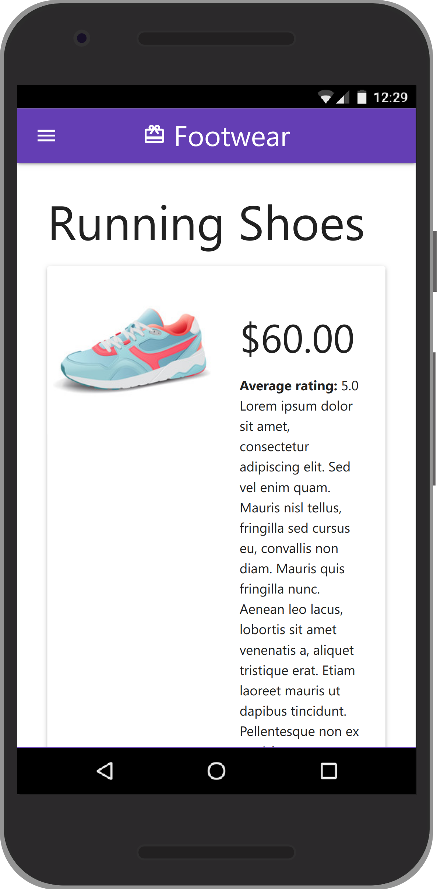
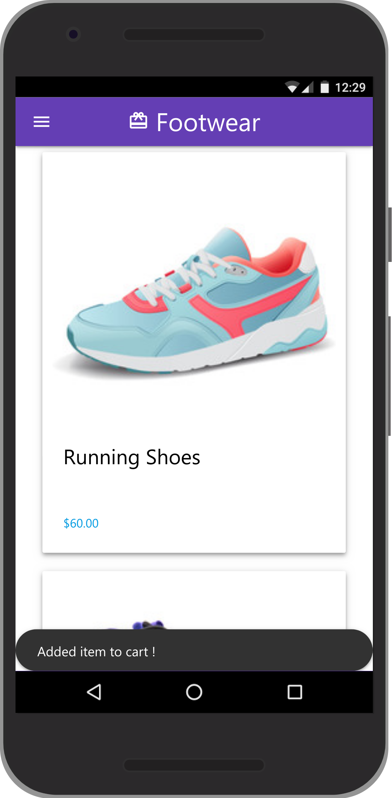
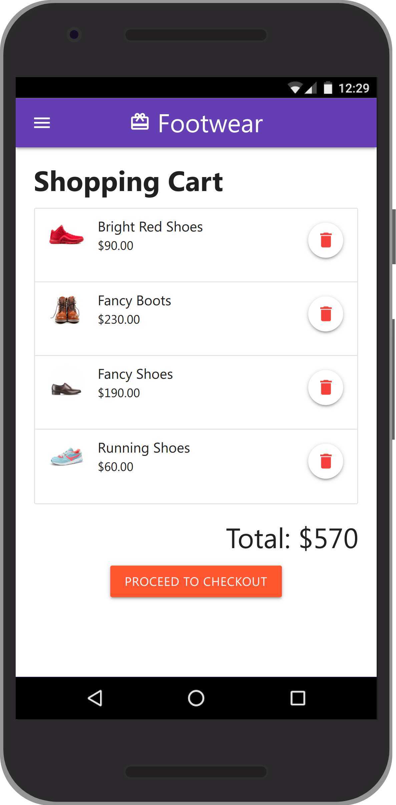

# Footwear

Footwear is a MEVN stack project which is a part of [Vue.js Creating and Hosting a Full Stack Site](https://www.linkedin.com/learning/vue-js-creating-and-hosting-a-full-stack-site). From the main course contents this repository is different in the context of:

- **Vue Version:** Vue 3 (Main Course is on Vue 2)
- **Design:** Materialize (Main is pure CSS)

This mini e-commerce includes following features.

- Get All Products
- Get Each Product Details
- Add Items To Cart
- Get Cart Items with Total Bill
- Remove an Item from Cart

## Demonstration



| Screenshot-1             | Screenshot-2             | Screenshot-3             |
| ------------------------ | ------------------------ | ------------------------ |
|  |  |  |

## How to run

Insert data intro mongo according to the way defined in db.md. Then run the following command:

```sh
cd api && npm run dev
```
